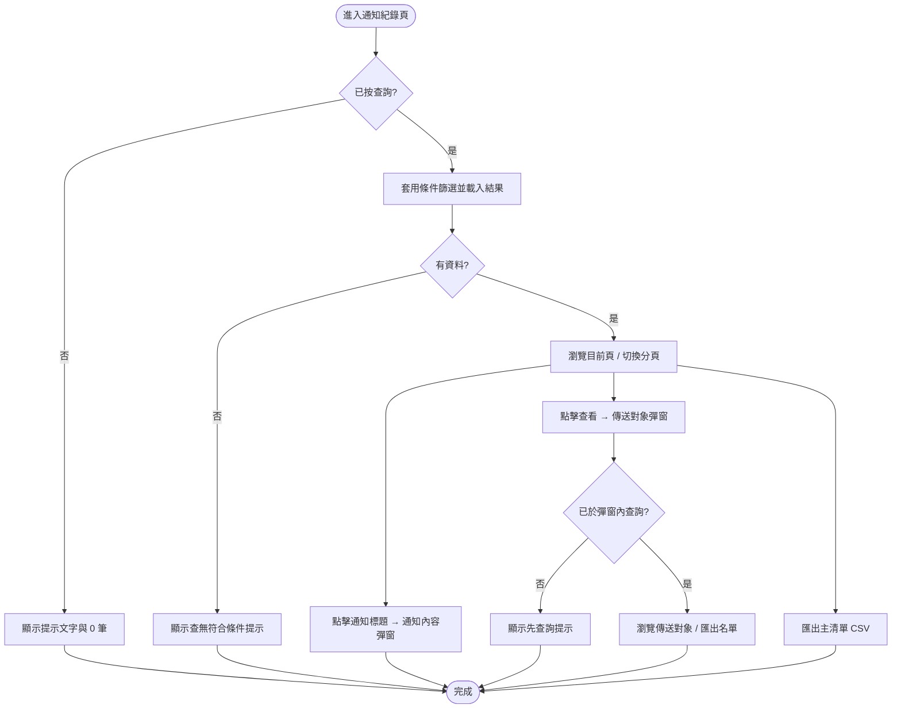

# 通知紀錄（推播紀錄）後台

---

# 0. 文件資訊（Document Info）

| 欄位 | 內容 |
| --- | --- |
| Feature ID | PRD-NC-001 |
| 所屬產品 | 推播／通知後台（蛙呀 CMS 生態內之紀錄查詢能力） |
| 平台 | 後台 |
| 文件狀態 | Draft |
| PM Owner | 汪宗翰 |
| UIUX Owner | （請填） |
| Tech Owner | （請填） |
| 建立日期 | 2026-05-14 |
| 最後更新 | 2026-05-14 |
| 需求來源證據 | [index.html](index.html)（HTML 互動原型，含前端模擬資料） |
| 相關連結 | Figma / Jira / API / Dashboard（請填） |

---

# 1. 功能概述（Overview）

## 功能目的

提供後台查詢與瀏覽歷史通知批次紀錄的能力，讓營運、稽核、客服人員可依多維度條件查詢已發送之通知，檢視清單、單筆通知內容、單一批次之傳送對象，並支援 CSV 匯出以利對帳與離線分析。

---

## 背景

營運與稽核人員需要追蹤通知發送狀況，目前缺乏統一的後台查詢介面。本功能於蛙呀 CMS 後台建立「通知紀錄」頁面，整合 8 種發送管道（APP離線推播、APP春聯、APP彈窗、APP跑馬燈、簡訊、LON、line@、Email）的歷史紀錄，提供條件篩選、內容檢視、名單查詢與 CSV 匯出能力。

---

## 商業目標

| 指標 | 目標 |
| --- | --- |
| 查詢任務完成率 | ≥ 95%（待訂） |
| 匯出成功率 | ≥ 99%（待訂） |
| 誤解相關客服工單數 | 上線後較基線下降（待訂） |

---

## Success Metrics

| KPI | 定義 | 數據來源 | 度量方式 |
| --- | --- | --- | --- |
| 查詢任務完成率 | 完成查詢並顯示結果之工作階段 / 點擊查詢之比率 | 後台行為埋點 | 事件比率統計 |
| 匯出成功率 | 匯出成功次數 / 匯出嘗試次數 | 後台行為埋點或伺服器記錄 | 事件比率統計 |
| 誤解相關客服工單數 | MAP 識別碼、發送狀態等欄位誤解產生之工單量 | 客服系統標籤 | 上線後對照基線週期 |

> **說明**：原型未含埋點；上線前由產品與數據團隊確認指標與事件命名。

---

# 2. 使用者情境（User Scenario）

## Target User

| Persona | 說明 |
| --- | --- |
| 內部營運人員 | 需追蹤通知發送紀錄、對帳、匯出離線分析 |
| 稽核人員 | 需查詢歷史通知批次與傳送對象以供稽核 |
| 客服支援人員 | 需協助用戶確認是否有收到特定通知 |

---

## 使用情境

1. 營運人員在推播活動後，需查詢特定批次的發送狀況與失敗數
2. 稽核人員需匯出某時間區間的通知紀錄做離線分析
3. 客服人員接到用戶反映未收到通知，需以身分證查詢該用戶是否在傳送對象中

---

## 使用者目標

1. 快速以多維度條件（MAP 識別碼、身分證、時間區間、管道、狀態等）定位目標通知批次
2. 檢視單筆通知依管道呈現之完整內容
3. 查詢特定批次之傳送對象名單
4. 匯出主清單與傳送對象明細以供離線作業

---

# 3. 功能流程（Flow）

## User Flow



---

## Wireflow / Prototype

| 類型 | Link |
| --- | --- |
| HTML Prototype | [index.html](index.html) |
| Figma | （請填） |

---

# 4. 功能規格（Functional Spec）

## 功能列表

| 功能 | 說明 |
| --- | --- |
| 4-1 整體版面與導覽 | 頂部列 + 左側導覽 + 主內容區 |
| 4-2 主表查詢條件 | 7 個查詢條件，AND 邏輯 |
| 4-3 操作列 | 清除、查詢、匯出主清單、系統說明 |
| 4-4 主表顯示與分頁 | 每頁 10 筆，圓形頁碼分頁導覽 |
| 4-5 通知內容彈窗 | 依管道組合欄位，檢視單筆通知內容 |
| 4-6 傳送對象彈窗 | 查詢 / 瀏覽 / 匯出單一批次傳送對象 |
| 4-7 匯出主清單 CSV | 固定 22 欄寬表 CSV |
| 4-8 系統說明彈窗 | 操作提示與名詞說明 |
| 4-9 提醒對話框 | STYLEGUILD3 規格之提醒 Dialog |

---

# 4-1 整體版面與導覽

## 功能目的

頁面採頂部列＋左側導覽＋主內容區佈局，提供全站導覽與使用者資訊。

---

## Trigger

| 類型 | 說明 |
| --- | --- |
| 自動觸發 | 進入頁面時自動渲染版面 |

---

## Input

N/A

---

## Output

| 類型 | 說明 |
| --- | --- |
| UI 顯示 | 頂部列（品牌 Logo、環境名稱、使用者問候、登出按鈕）、左側導覽（選單群組）、主內容區 |

---

## 商業邏輯

- 頂部列：顯示口袋證券品牌 Logo、環境名稱（如「測試環境」）、使用者問候（格式 `{權限角色} {PK 編號}，您好`）、登出按鈕
- 左側導覽：首頁、審核、客戶管理、資料查詢、商品檔；「推播訊息」群組下含多個推播入口與「推播紀錄」（目前頁）
- 「推播紀錄」以作用中樣式標示（紅色強調、左側色條）
- 主內容區為「通知紀錄」卡片區塊

---

## 驗證規則

N/A

---

## 狀態（State）

| 狀態 | 說明 |
| --- | --- |
| Default | 頁面載入後顯示完整版面，左側「推播紀錄」為 active 狀態 |

---

## Error Handling

| 錯誤情境 | UI 行為 |
| --- | --- |
| 登出失敗 | 正式環境依 SSO 流程處理（原型未實作） |

---

## Edge Case

| 情境 | 處理方式 |
| --- | --- |
| 小螢幕 ≤ 960px | 左側導覽改為上方堆疊、表單區改單欄排版 |

---

# 4-2 主表查詢條件

## 功能目的

提供多維度篩選條件，讓使用者定位目標通知批次。

---

## Trigger

| 類型 | 說明 |
| --- | --- |
| 點擊 | 使用者填寫條件後點擊「查詢」按鈕觸發篩選 |

---

## Input

| 欄位 | 型態 | 必填 | 說明 |
| --- | --- | --- | --- |
| MAP 識別碼 | text | 否 | 最多 5 字（`maxlength="5"`）；不分大小寫、部分相符 |
| 身分證 | text | 否 | 與該筆通知之傳送對象中任一身分證比對；不分大小寫、部分相符 |
| 通知時間區間（起） | datetime-local | 否 | 日期＋時分；可只填起或只填訖 |
| 通知時間區間（訖） | datetime-local | 否 | 同上 |
| 通知標題 | text | 否 | 關鍵字搜尋；比對通知標題、主旨、內文、跑馬燈內容、內部名稱、line@ 內文、line@ JSON；不分大小寫、部分相符 |
| 發送管道 | select | 否 | 選項：全部、APP離線推播、APP春聯、APP彈窗、APP跑馬燈、簡訊、LON、line@、Email；預設「全部」 |
| 發送狀態 | select | 否 | 選項：全部、成功、失敗；預設「全部」 |
| 建立者 | text | 否 | 比對建立者姓名與 PK 編號；不分大小寫、部分相符 |

---

## Output

| 類型 | 說明 |
| --- | --- |
| UI 顯示 | 篩選後的主表結果（見 4-4） |

---

## 商業邏輯

- 所有條件間為 **AND** 邏輯
- 空白條件視為不篩選（不限制）
- 「全部」選項視為不限制
- 身分證條件比對的是該批次傳送對象中任一筆身分證，非批次本身欄位
- 通知時間區間：起訖可只填一邊；比對邏輯為 `>= 起` 且 `<= 訖`

---

## 驗證規則

| 條件 | 行為 |
| --- | --- |
| MAP 識別碼超過 5 字 | 前端 `maxlength` 限制，無法輸入超過 5 字 |
| 時間起 > 時間訖 | 原型不阻擋輸入，查詢結果為 0 筆 |

---

## 狀態（State）

| 狀態 | 說明 |
| --- | --- |
| Default | 所有欄位空白 / 下拉為「全部」 |

---

## Error Handling

N/A

---

## Edge Case

| 情境 | 處理方式 |
| --- | --- |
| 所有條件皆為空白 / 全部 | 查詢回傳全量資料 |
| 僅填身分證 | 只要該批次傳送對象中有任一筆匹配即列入結果 |
| 通知標題關鍵字匹配 line@ JSON 字串 | JSON 內容字串亦納入比對 |

---

# 4-3 操作列

## 功能目的

提供查詢執行、條件重置、主清單匯出與系統說明入口。

---

## Trigger

| 類型 | 說明 |
| --- | --- |
| 點擊 | 使用者點擊操作列按鈕 |

---

## Input

N/A

---

## Output

| 類型 | 說明 |
| --- | --- |
| UI 顯示 | 依按鈕功能觸發對應行為 |

---

## 商業邏輯

| 按鈕 | 行為 |
| --- | --- |
| 清除 | 還原所有查詢條件為預設值（文字欄清空、下拉回「全部」），回到「未查詢」狀態，不載入列表 |
| 查詢 | 讀取當前條件、執行篩選、記錄查詢時間（格式 `YYYY/MM/DD HH:mm:ss`）、重置主表分頁為第 1 頁 |
| 匯出主清單 | 若未查詢 → 彈出提醒「請先輸入查詢條件並執行查詢。」；否則匯出目前條件下之完整結果集 CSV |
| 系統說明 | 開啟系統說明彈窗 |

---

## 驗證規則

| 條件 | 行為 |
| --- | --- |
| 未執行查詢即匯出 | 顯示提醒對話框：「請先輸入查詢條件並執行查詢。」 |

---

## 狀態（State）

N/A

---

## Error Handling

| 錯誤情境 | UI 行為 |
| --- | --- |
| 匯出時無任何資料列 | 顯示提醒對話框：「目前沒有可匯出的資料。」 |

---

## Edge Case

| 情境 | 處理方式 |
| --- | --- |
| 連續快速點擊查詢 | 每次點擊皆以當前條件重新篩選並重置分頁 |

---

# 4-4 主表顯示與分頁

## 功能目的

以表格形式顯示查詢結果，支援分頁瀏覽。

---

## Trigger

| 類型 | 說明 |
| --- | --- |
| 自動觸發 | 查詢執行後自動渲染主表 |
| 點擊 | 分頁頁碼或導覽按鈕切換頁面 |

---

## Input

N/A

---

## Output

| 類型 | 說明 |
| --- | --- |
| UI 顯示 | 查詢時間、總筆數、主表、分頁導覽列 |

---

## 商業邏輯

### 主表欄位（由左至右）

| 欄位 | 說明 |
| --- | --- |
| MAP 識別碼 | 批次 MAP 識別碼 |
| 通知開始時間 | APP春聯 → 春聯起始時間；APP彈窗/APP跑馬燈 → 通知視窗起始；其他 → 通知時間 |
| 通知結束時間 | APP春聯 → 春聯結束時間；APP彈窗/APP跑馬燈 → 通知視窗結束；其他 → 顯示「-」 |
| 通知標題 | 顯示規則見下方「通知標題欄遞補邏輯」；可點擊開啟通知內容彈窗 |
| 發送管道 | 管道名稱 |
| 發送總數 | APP彈窗、APP春聯、APP跑馬燈顯示「-」；其他顯示數字 |
| 發送失敗數 | APP彈窗、APP春聯、APP跑馬燈顯示「-」；其他顯示數字 |
| 建立者 | 雙行顯示：第一行姓名、第二行 PK 編號（灰色小字）；無建立者顯示「-」 |
| 發送狀態 | APP彈窗、APP春聯、APP跑馬燈顯示「-」；其他以圓角標籤呈現「成功」（綠色）或「失敗」（紅色） |
| 傳送對象 | 「查看」按鈕，點擊開啟傳送對象彈窗 |

### 通知標題欄遞補邏輯

依以下順序取第一個有值者，截斷為前 10 字顯示（完整文字以 `title` tooltip 呈現）：

1. 通知標題（`notifyTitle`）
2. line@ 且有 JSON → 固定顯示「Line Bubble」
3. line@ 僅有圖片（無標題、無主旨、無內文）→ 固定顯示「圖片」
4. 通知主旨（LON 管道取 `lonSubject`，其他取 `subject`）
5. 通知內文（line@ 取 `lineTextBody`、APP跑馬燈取 `tickerContent`，其他取 `content`）
6. 以上皆無 → 顯示「-」

### 分頁規則

- 固定每頁 **10 筆**
- 分頁導覽列置中顯示
- 導覽元素（由左至右）：最前頁 `«`、上一頁 `‹`、頁碼（圓形按鈕）、下一頁 `›`、最末頁 `»`
- 超過 7 頁時：中間以省略號 `...` 表示，當前頁前後各顯示 2 頁
- 邊界頁時：最前頁/上一頁 或 下一頁/最末頁 按鈕自動停用（`disabled`）
- 當前頁碼以填色圓形（`#f05a66` 背景白字）標示

---

## 驗證規則

N/A

---

## 狀態（State）

| 狀態 | 說明 |
| --- | --- |
| 未查詢 | 查詢時間顯示「—」；總筆數 0；表身顯示「請輸入查詢條件後點選查詢。」 |
| 已查詢無資料 | 顯示查詢時間、總筆數 0；表身顯示「查無符合條件的通知紀錄。」 |
| 已查詢有資料 | 顯示查詢時間、總筆數；主表以每頁 10 筆顯示，底部顯示分頁導覽列 |

---

## Error Handling

| 錯誤情境 | UI 行為 |
| --- | --- |
| API Timeout | （待定義，原型為純前端模擬） |
| 無資料 | 表身顯示空狀態提示文字 |

---

## Edge Case

| 情境 | 處理方式 |
| --- | --- |
| 恰好 10 筆 | 僅顯示 1 頁，無省略號 |
| 最後一頁不足 10 筆 | 正常顯示剩餘筆數 |
| 切換分頁後再次查詢 | 重置為第 1 頁 |

---

# 4-5 通知內容彈窗

## 功能目的

檢視單筆通知依發送管道應呈現之完整文案與附圖/JSON 等。

---

## Trigger

| 類型 | 說明 |
| --- | --- |
| 點擊 | 點擊主表「通知標題」欄之文字按鈕 |

---

## Input

| 欄位 | 型態 | 必填 | 說明 |
| --- | --- | --- | --- |
| notification ID | hidden | 是 | 由點擊事件帶入之通知批次 PK |

---

## Output

| 類型 | 說明 |
| --- | --- |
| UI 顯示 | 通知內容彈窗（800px 寬） |

---

## 商業邏輯

### 彈窗標題列

- 背景色 `#fb5868`（紅色），白色文字
- 標題：與主表「通知標題」欄相同的遞補邏輯（前 10 字截斷）
- 右上角關閉按鈕 `×`

### 依管道顯示欄位組合

| 發送管道 | 顯示欄位（由上至下） |
| --- | --- |
| APP離線推播 | 主旨、內文、到達網頁 |
| APP春聯 | 外層主旨（`notifyTitle`）、內容主旨（`subject`）、內文、到達網頁 |
| APP彈窗 | 主旨、到達網址；若有圖片則顯示圖片，否則顯示內文（二擇一） |
| APP跑馬燈 | 內部名稱、跑馬燈內容、到達網址 |
| 簡訊 | 內文 |
| LON | 主旨、說明、資訊欄、註冊內容、註冊時間、按鈕網址、按鈕文字 |
| line@ | 內文（若有）、圖片（若有）、JSON（若有）— 依資料有無動態組合 |
| Email | 以 sandbox iframe 預覽 HTML 信件內容（最小高度 360px） |

### 關閉方式

- 右上角 `×` 按鈕
- 底部「確認」按鈕
- 點擊遮罩區域

---

## 驗證規則

N/A

---

## 狀態（State）

| 狀態 | 說明 |
| --- | --- |
| Default | 彈窗開啟，依管道顯示對應欄位 |

---

## Error Handling

| 錯誤情境 | UI 行為 |
| --- | --- |
| Email 無內文 | iframe 內顯示「（無內文）」 |
| 通知標題為空 | 標題列依遞補邏輯顯示 |

---

## Edge Case

| 情境 | 處理方式 |
| --- | --- |
| line@ 同時有內文、圖片、JSON | 三者皆顯示 |
| APP彈窗有圖片 | 不顯示內文，僅顯示圖片 |
| APP彈窗無圖片 | 顯示內文，不顯示圖片 |
| 關閉彈窗 | 清除動態插入之 HTML 內容（避免快取殘影） |

---

# 4-6 傳送對象彈窗

## 功能目的

檢視單一批次傳送對象名單，支援篩選、分頁、匯出。

---

## Trigger

| 類型 | 說明 |
| --- | --- |
| 點擊 | 點擊主表「傳送對象」欄之「查看」按鈕 |

---

## Input

| 欄位 | 型態 | 必填 | 說明 |
| --- | --- | --- | --- |
| 身分證 | text | 否 | 不分大小寫、部分相符 |
| 姓名 | text | 否 | 不分大小寫、部分相符 |

---

## Output

| 類型 | 說明 |
| --- | --- |
| UI 顯示 | 傳送對象彈窗（1120px 寬） |

---

## 商業邏輯

### 標題列

- 標題：`傳送對象 | {通知標題}`（通知標題依主表遞補邏輯取完整文字）
- 副標：`MAP識別碼 {值} / 發送管道 {值} / 發送狀態 {值}`
  - APP彈窗、APP春聯、APP跑馬燈之發送狀態顯示「-」

### 查詢條件

- 身分證、姓名；條件間為 **AND**；部分相符、不分大小寫
- 「清除」按鈕：重置條件並回到未查詢狀態
- 「查詢」按鈕：執行篩選並顯示結果

### 名單表格欄位

| 欄位 | 說明 |
| --- | --- |
| 序號 | 傳送對象序號 |
| 身分證 | 傳送對象身分證字號 |
| 姓名 | 傳送對象姓名 |
| 證券帳號 | 傳送對象證券帳號 |
| 發送狀態 | APP彈窗、APP春聯、APP跑馬燈顯示「-」；其他以標籤呈現「成功」或「失敗」 |

### 排序規則

依以下欄位遞增排序（含字母數字混合排序）：證券帳號 → 身分證 → 姓名 → 序號

### 分頁規則

- 固定每頁 **10 筆**
- 分頁導覽列置中顯示
- 樣式與主表分頁一致（圓形頁碼按鈕、省略號邏輯相同）

### 匯出

- 「匯出對象」按鈕
- 前置：須已於彈窗內執行查詢；否則提醒「請先於傳送對象輸入查詢條件並執行查詢。」
- 檔名：`傳送對象明細.csv`
- 編碼：UTF-8 BOM
- 欄位：序號、身分證、姓名、證券帳號、發送狀態
  - APP彈窗、APP春聯、APP跑馬燈之發送狀態匯出為「-」

### 關閉方式

- 右上角「關閉」按鈕
- 點擊遮罩區域

---

## 驗證規則

| 條件 | 行為 |
| --- | --- |
| 未查詢即匯出 | 顯示提醒對話框 |

---

## 狀態（State）

| 狀態 | 說明 |
| --- | --- |
| Default（未查詢） | 總筆數 0；表身顯示「請輸入查詢條件後點選查詢。」 |
| 已查詢無資料 | 總筆數 0；表身顯示「查無符合條件的傳送對象資料。」 |
| 已查詢有資料 | 顯示總筆數、名單表格與分頁導覽 |

---

## Error Handling

| 錯誤情境 | UI 行為 |
| --- | --- |
| 匯出無資料 | 顯示提醒「目前沒有可匯出的資料。」 |

---

## Edge Case

| 情境 | 處理方式 |
| --- | --- |
| 開啟彈窗時 | 預設未查詢，不載入名單 |
| 切換不同批次開啟 | 每次開啟重置查詢狀態與條件 |

---

# 4-7 匯出主清單 CSV

## 功能目的

將目前查詢條件下之完整結果集匯出為 CSV 檔案。

---

## Trigger

| 類型 | 說明 |
| --- | --- |
| 點擊 | 點擊「匯出主清單」按鈕 |

---

## Input

N/A（使用當前查詢條件之完整結果集）

---

## Output

| 類型 | 說明 |
| --- | --- |
| 檔案下載 | `通知主清單.csv`，UTF-8 BOM 編碼 |

---

## 商業邏輯

### 前置條件

- 須已執行主表查詢；否則提醒先查詢
- 匯出範圍為目前條件下之**完整結果集**（不受分頁限制）

### 欄位順序（固定 22 欄，由左至右）

| 序 | 表頭欄名 | 資料意義 |
| --- | --- | --- |
| 1 | MAP識別碼 | 批次 MAP 識別 |
| 2 | 通知開始時間 | 與主表「通知開始時間」欄相同邏輯 |
| 3 | 通知結束時間 | 與主表「通知結束時間」欄相同邏輯 |
| 4 | 通知標題 | 主表「通知標題」遞補邏輯之前 10 字截斷文字 |
| 5 | 通知主旨 | 主旨欄位原始值 |
| 6 | 通知內文 | 內文欄位原始值 |
| 7 | 到達網頁 | APP離線推播/APP春聯之到達頁 URL |
| 8 | 圖片URL | APP彈窗附圖 URL 優先，否則 line@ 附圖 URL（同一欄二擇一） |
| 9 | 跑馬燈內部名稱 | APP跑馬燈內部名稱 |
| 10 | 跑馬燈內文 | APP跑馬燈對外顯示內容 |
| 11 | LON說明 | LON 說明 |
| 12 | LON資訊欄 | LON 資訊欄 |
| 13 | LON註冊內容 | LON 註冊內容 |
| 14 | LON註冊時間 | LON 註冊時間 |
| 15 | LON按鈕網址 | LON 按鈕連結 |
| 16 | LON按鈕文字 | LON 按鈕文案 |
| 17 | JSON | line@ Flex/JSON 字串 |
| 18 | 發送管道 | 管道名稱 |
| 19 | 發送總數 | APP彈窗/APP春聯/APP跑馬燈為「-」；其他為數字 |
| 20 | 發送失敗數 | APP彈窗/APP春聯/APP跑馬燈為「-」；其他為數字 |
| 21 | 建立者 | 姓名 + 換行 + PK 編號；無建立者為「-」 |
| 22 | 發送狀態 | APP彈窗/APP春聯/APP跑馬燈為「-」；其他為「成功」或「失敗」 |

非該列管道適用之欄位匯出為**空字串**。

---

## 驗證規則

| 條件 | 行為 |
| --- | --- |
| 未查詢 | 提醒對話框：「請先輸入查詢條件並執行查詢。」 |
| 無資料列 | 提醒對話框：「目前沒有可匯出的資料。」 |

---

## 狀態（State）

N/A

---

## Error Handling

| 錯誤情境 | UI 行為 |
| --- | --- |
| 瀏覽器不支援 Blob 下載 | （待定義） |

---

## Edge Case

| 情境 | 處理方式 |
| --- | --- |
| 大量資料匯出 | 原型為前端 Blob 生成；正式環境效能待評估 |
| CSV 含逗號/引號 | 欄位值以雙引號包裹，內部雙引號以 `""` 跳脫 |

---

# 4-8 系統說明彈窗

## 功能目的

提供操作提示與名詞解釋，降低使用者對 MAP 識別碼、發送狀態等欄位之誤解。

---

## Trigger

| 類型 | 說明 |
| --- | --- |
| 點擊 | 點擊頁面右上角「系統說明」按鈕 |

---

## Input

N/A

---

## Output

| 類型 | 說明 |
| --- | --- |
| UI 顯示 | 系統說明彈窗（640px 寬） |

---

## 商業邏輯

說明內容（與原型文案一致）：

1. 請先設定查詢條件後按「查詢」，主清單預設不載入資料；查詢結果每頁 10 筆，可使用分頁切換最前頁、上一頁、頁碼、下一頁、最末頁。
2. 通知時間區間支援日期與時分。
3. 發送狀態為訊息中心發送給外部廠商的結果，無法判斷用戶是否收到。
4. ＭＡＰ識別碼為ＭＡＰ系統對該批次之辨識。

### 關閉方式

- 「關閉」按鈕
- 點擊遮罩區域

---

## 驗證規則

N/A

---

## 狀態（State）

| 狀態 | 說明 |
| --- | --- |
| Default | 彈窗開啟顯示說明內容 |

---

## Error Handling

N/A

---

## Edge Case

N/A

---

# 4-9 提醒對話框

## 功能目的

以 STYLEGUILD3 規格之模態對話框，顯示操作前置提醒或確認訊息。

---

## Trigger

| 類型 | 說明 |
| --- | --- |
| 自動觸發 | 當特定操作前置檢查未通過時觸發（如未查詢即匯出） |

---

## Input

| 欄位 | 型態 | 必填 | 說明 |
| --- | --- | --- | --- |
| title | string | 是 | 對話框標題（通常為「提醒」） |
| message | string | 是 | 提醒訊息內容 |

---

## Output

| 類型 | 說明 |
| --- | --- |
| UI 顯示 | 480px 寬的提醒對話框 |

---

## 商業邏輯

### 對話框結構

- 標題列：居中顯示標題（預設「提醒」），下方分隔線
- 內容區：居中顯示訊息文字（最小高度 75px）
- 底部：居中「確認」按鈕（140px × 40px，`#e95465` 背景）

### 使用場景

| 場景 | 標題 | 訊息 |
| --- | --- | --- |
| 主表未查詢即匯出 | 提醒 | 請先輸入查詢條件並執行查詢。 |
| 傳送對象未查詢即匯出 | 提醒 | 請先於傳送對象輸入查詢條件並執行查詢。 |
| 匯出無資料 | 提醒 | 目前沒有可匯出的資料。 |

### 關閉方式

- 「確認」按鈕
- 點擊遮罩區域

---

## 驗證規則

N/A

---

## 狀態（State）

| 狀態 | 說明 |
| --- | --- |
| Default | 對話框開啟，焦點移至「確認」按鈕 |

---

## Error Handling

N/A

---

## Edge Case

| 情境 | 處理方式 |
| --- | --- |
| 提醒對話框與其他彈窗重疊 | 提醒對話框 z-index 較高（`z-index: 50`），覆蓋於其他彈窗之上 |

---

# 5. UX/UI 規格

## UI 元件

| 元件 | 說明 |
| --- | --- |
| Button - Primary | `#e95465` 背景、白字、圓角 8px、min-width 120px、height 40px |
| Button - Secondary | 白色背景、`#e95465` 邊框與文字、圓角 8px |
| Button - Mini | 白色背景、`#e95465` 邊框與文字、圓角 8px、min-width 68px、height 30px（用於主表操作欄） |
| Input / Select | 白色背景、`#9e9e9f` 邊框、圓角 8px、min-height 40px |
| Table | 表頭 `#fbe3e3` 背景、資料列奇偶交替色（`#eeeeef` / `#fff2f2`） |
| Status Chip | 圓角藥丸標籤；成功：綠色（`#15803d`）；失敗：紅色（`#b91c1c`） |
| Pager Ring | 40px 圓形按鈕；當前頁 `#f05a66` 填色白字；非當前頁 `#f05a66` 邊框；導覽鍵 `#9e9e9e` 邊框 |
| Modal - Content | 1120px 寬、最大高度 90vh、白色背景、圓角 10px、陰影 |
| Modal - Message | 800px 寬、紅色標題列 `#fb5868` |
| Modal - Help | 640px 寬 |
| Dialog - Reminder | 480px 寬、STYLEGUILD3 規格、圓角 8px |
| Modal Backdrop | 黑色半透明遮罩 `rgba(0,0,0,0.25)` |

---

## UX Reasoning

- **預設不載入資料**：避免全量載入造成效能問題與資訊過載
- **條件間 AND 邏輯**：符合後台報表查詢的慣用模式
- **圓形分頁按鈕**：符合蛙呀 CMS 現有 UI 風格
- **匯出前置檢查**：防止誤操作匯出空檔案
- **通知標題遞補邏輯**：確保每列主表都有可辨識的標題文字
- **管道差異化顯示**：APP彈窗/APP春聯/APP跑馬燈不具個別發送追蹤，故相關統計欄位顯示「-」

---

## 文案規範

| 位置 | 文案 |
| --- | --- |
| 主表未查詢提示 | 請輸入查詢條件後點選查詢。 |
| 主表查無資料提示 | 查無符合條件的通知紀錄。 |
| 傳送對象未查詢提示 | 請輸入查詢條件後點選查詢。 |
| 傳送對象查無資料提示 | 查無符合條件的傳送對象資料。 |
| 提醒 - 未查詢即匯出主清單 | 請先輸入查詢條件並執行查詢。 |
| 提醒 - 未查詢即匯出對象 | 請先於傳送對象輸入查詢條件並執行查詢。 |
| 提醒 - 無可匯出資料 | 目前沒有可匯出的資料。 |
| 查詢時間顯示格式 | 查詢時間：YYYY/MM/DD HH:mm:ss |
| 未查詢時查詢時間 | 查詢時間：— |
| 總筆數格式 | 共有 {N} 筆資料（N 為紅色粗體） |

---

## 動效規格

| 動效 | 說明 |
| --- | --- |
| Button hover | `translateY(-1px)` 上浮、0.2s ease |
| Sidebar link hover | 背景 `rgba(255,255,255,0.65)`、文字變紅色、0.15s ease |
| Pager ring hover | 淺色背景覆蓋、0.15s ease |
| Modal open/close | 遮罩 `display: none` ↔ `display: flex` 切換（無動畫過渡） |
| STYLEGUILD3 button active | `scale(0.98)` 按壓效果 |
| STYLEGUILD3 button hover | `brightness(1.05)` 微亮效果 |

---

# 6. Tracking / Data

## Event Tracking

| Event Name | Trigger | Parameters |
| --- | --- | --- |
| notification_query | 點擊「查詢」按鈕 | filters（各條件值）、result_count |
| notification_export_main | 點擊「匯出主清單」且成功匯出 | result_count |
| notification_export_main_blocked | 點擊「匯出主清單」但未查詢 | — |
| notification_view_content | 點擊通知標題開啟內容彈窗 | channel、map_id |
| notification_view_recipients | 點擊「查看」開啟傳送對象彈窗 | channel、map_id |
| recipient_query | 於傳送對象彈窗點擊「查詢」 | filters、result_count |
| recipient_export | 點擊「匯出對象」且成功匯出 | result_count |
| recipient_export_blocked | 點擊「匯出對象」但未查詢 | — |
| system_help_open | 點擊「系統說明」 | — |
| notification_page_change | 主表切換分頁 | page_number、total_pages |
| recipient_page_change | 傳送對象彈窗切換分頁 | page_number、total_pages |

> **說明**：以上為建議事件清單，正式命名與參數由產品與數據團隊上線前確認。

---

## Dashboard

| 工具 | Link |
| --- | --- |
| GA4 | （請填） |
| Metabase | （請填） |

---

## KPI Mapping

| KPI | 對應 Event |
| --- | --- |
| 查詢任務完成率 | notification_query（成功率） |
| 匯出成功率 | notification_export_main / (notification_export_main + notification_export_main_blocked) |
| 功能使用率 | 各 Event 總觸發次數 |

---

# 7. API / Technical

## API List

| API | 用途 |
| --- | --- |
| GET /api/notifications | 依查詢條件取得通知批次清單（含分頁） |
| GET /api/notifications/{id} | 取得單筆通知內容（含各管道欄位） |
| GET /api/notifications/{id}/recipients | 取得單一批次傳送對象清單（含篩選與分頁） |
| GET /api/notifications/export | 匯出主清單 CSV（伺服器端生成） |
| GET /api/notifications/{id}/recipients/export | 匯出傳送對象明細 CSV |

> **說明**：以上為建議 API 路徑，正式 endpoint 與參數由後端團隊定義。原型為純前端模擬。

---

## API Request

### GET /api/notifications

```json
{
  "map_id": "AB12C",
  "id_no": "A123456789",
  "notify_start": "2026-01-01T00:00",
  "notify_end": "2026-03-31T23:59",
  "title_keyword": "會員",
  "channel": "APP離線推播",
  "status": "成功",
  "creator": "王小明",
  "page": 1,
  "page_size": 10
}
```

---

## API Response

### GET /api/notifications

```json
{
  "success": true,
  "data": {
    "total": 128,
    "page": 1,
    "page_size": 10,
    "items": [
      {
        "pk": 10001,
        "map_id": "AB12C",
        "notify_time": "2026-01-15 10:30:00",
        "notify_title": "會員升等通知",
        "subject": "恭喜您升等啦",
        "content": "親愛的會員您好...",
        "channel": "APP離線推播",
        "total_count": 150,
        "failed_count": 2,
        "creator_name": "王小明",
        "creator_pk": "PK001",
        "status": "成功"
      }
    ]
  }
}
```

---

## Technical Constraints

- CSV 編碼必須為 UTF-8 BOM，以確保 Excel 正確開啟中文內容
- Email 管道之 HTML 信件以 sandbox iframe 預覽，不執行腳本
- 正式環境查詢是否有逾時或筆數上限待確認
- 匯出為完整結果集（不受前端分頁限制），大量資料時效能待評估
- 身分證欄位涉及個資，匯出與顯示之遮罩機制待確認

---

# 8. 權限與角色（Permission）

| 角色 | 權限 |
| --- | --- |
| 最高權限者 | 可存取本頁所有功能（查詢、檢視內容、檢視傳送對象、匯出） |
| 一般後台使用者 | 依權限分級決定是否可存取本頁（待權限 PRD / HLD 定義） |
| 無權限使用者 | 不可進入本頁（登入流程與權限判斷不在本頁範圍） |

> **說明**：原型示意使用者為「最高權限者 pk099」。正式環境之權限模型由權限 PRD / HLD 定義，涉及個資（身分證、姓名）之查詢與匯出須符合公司個資與權限規範。

---

# 9. Known Issues

| 問題 | 原因 | 是否修復 |
| --- | --- | --- |
| 頁面標題「通知紀錄」與選單「推播紀錄」用語不一致 | 原型設計沿用兩種名稱 | 待確認是否統一 |
| 原型為純前端模擬資料 | 開發階段先以前端原型驗證互動 | 正式版需整合後端 API |
| STYLE 資料夾 `SYTLEGUILD1` 檔名拼字錯誤 | 原始檔案命名失誤 | 低優先修正 |
| 正式環境查詢逾時/匯出筆數上限未定義 | 待後端評估效能 | 待補充 |
| 身分證欄位是否需遮罩顯示/下載控管 | 個資規範待確認 | 待補充 |

---

# 10. Future Plan

| 項目 | 說明 |
| --- | --- |
| 進階篩選 | 新增更多查詢條件（如批次編號、來源系統等） |
| 批次操作 | 支援勾選多筆批次一次匯出 |
| 即時通知狀態 | 整合實際發送通道回報，顯示終端用戶接收狀態 |
| 操作稽核日誌 | 記錄查詢與匯出操作以供稽核 |
| 匯出格式擴充 | 支援 Excel (.xlsx) 等格式匯出 |

---

# 11. Changelog

| 日期 | 修改內容 | 修改人 |
| --- | --- | --- |
| 2026-05-14 | 依標準模板重寫 PRD；以 index.html 原型為準，統一使用「傳送對象」術語、主表改為「通知開始時間/通知結束時間」雙欄 | 汪宗翰 |
