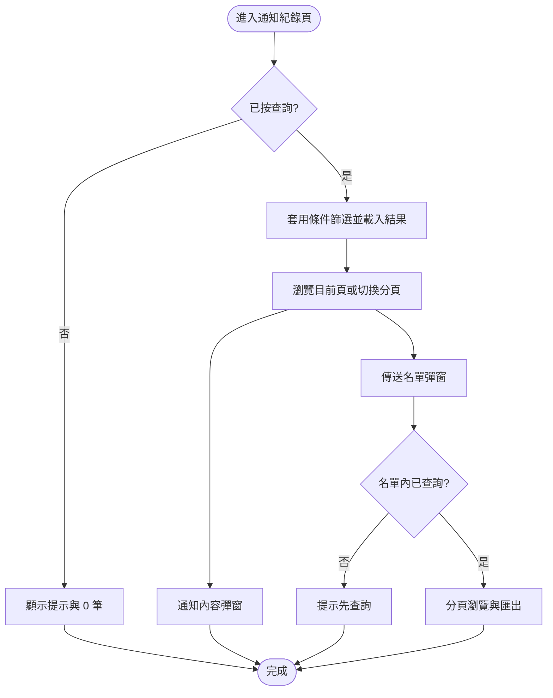
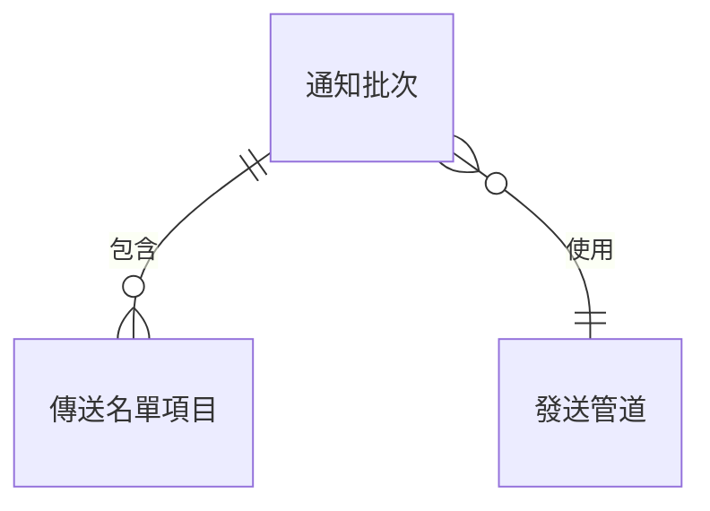

# PRD：通知紀錄（推播紀錄）後台

> **文件版本**: 1.6  
> **狀態**: 草稿  
> **作者**: （請填）  
> **建立日期**: 2026-04-02  
> **最後更新**: 2026-04-02  

---

## 元信息

| 項目 | 內容 |
|------|------|
| PRD 編號 | PRD-NC-001 |
| 需求來源證據 | [index.html](index.html)（HTML 互動原型，含前端模擬資料） |
| PRD 類型 | 新功能（有 UI） |
| 備註 | 側欄選單項目之實際路由與權限以 CMS／既有後台架構為準；本檔僅描述本頁可觀察之互動與規則 |

---

## 1. 文件信息

### 1.1 基本信息

| 屬性 | 值 |
|------|-----|
| PRD 編號 | PRD-NC-001 |
| 所屬產品 | 推播／通知後台（蛙呀 CMS 生態內之紀錄查詢能力，實際歸屬以產品線為準） |
| 優先級 | P0（請與 PO 確認） |
| 預計版本 | （請填） |
| PRD 基線版本 | v1.6 |
| 最後同步日期 | 2026-04-02 |

### 1.2 修訂歷史

| 版本 | 日期 | 變更內容 | 作者 |
|------|------|----------|------|
| 1.0 | 2026-04-02 | 初稿：依 index.html 原型撰寫 | — |
| 1.1 | 2026-04-09 | 主清單 CSV 之發送狀態改為中文（成功／失敗），與畫面一致 | — |
| 1.2 | 2026-04-10 | 傳送名單彈窗移除發送狀態篩選、表格欄與 CSV 欄；與 index 原型一致 | — |
| 1.3 | 2026-04-11 | 主清單 CSV 改為寬表：固定表頭含各管道延伸欄，非該管道適用者為空 | — |
| 1.3.1 | 2026-04-11 | 明確與原版 11 欄合併為同一檔、同一列（先基底欄再延伸欄） | — |
| 1.4 | 2026-04-11 | 主清單 CSV 欄位順序與表頭依營運規格重排（22 欄）；圖片URL／JSON 對應見 §5.5.1 | — |
| 1.5 | 2026-04-02 | 移除主表「春聯起訖時間」查詢；APP春聯之通知內容彈窗欄位明確為外層主旨、內容主旨、內文、到達網頁 | — |
| 1.6 | 2026-04-02 | 主表改為固定每頁 10 筆之分頁（含最前／上一頁／頁碼／下一頁／最末），移除瀑布流載入 | — |

### 1.3 術語表

| 術語 | 定義 |
|------|------|
| MAP 識別碼 | 於列表與彈窗中標示之批次識別；原型中為每筆通知之識別欄位（與 MAP 平台之對應關係為業務定義） |
| 發送狀態（批次） | 該批次呼叫發送服務之結果（成功／失敗）；**不代表**終端用戶是否實際收到（見系統說明） |
| 主表分頁 | 查詢後以固定每頁 10 筆顯示主表；使用者可透過分頁列切換最前頁、上一頁、頁碼、下一頁、最末頁（與傳送名單彈窗分頁樣式一致） |
| 通知標題／通知主旨／通知內文 | 內容欄位於不同管道下之展示組合不同；列表「通知標題」欄優先顯示通知標題，無則顯示主旨之前 15 字（原型行為） |

---

## 2. 背景與目標

### 2.1 業務背景

營運與稽核人員需在後台依多維度條件查詢**已發送之通知批次**，檢視清單、單筆通知內容、單一批次之傳送名單，並支援匯出以利對帳與離線分析。原型呈現之頁面標題為「**通知紀錄**」，左側導覽目前頁為「**推播紀錄**」。

### 2.2 產品目標

| 目標 | 說明 |
|------|------|
| G1 | 可查詢並瀏覽歷史通知批次，避免預設載入全量 |
| G2 | 可下钻檢視單筆通知內容（依發送管道呈現不同欄位組合） |
| G3 | 可下钻檢視單一批次之傳送名單並篩選、分頁 |
| G4 | 可匯出主清單與傳送名單明細（CSV），編碼與欄位規則見功能需求 |
| G5 | 透過「系統說明」降低對 MAP、發送狀態等欄位之誤解 |

### 2.3 成功指標

| 指標 | 目標值 | 數據來源 | 度量方式 |
|------|--------|----------|----------|
| 查詢任務完成率 | （待訂，例：≥ 95%） | 需後台行為埋點或節流日誌 | 完成查詢並顯示結果之工作階段／點擊查詢之比率 |
| 匯出成功率 | （待訂） | 同上或伺服器匯出任務記錄 | 匯出成功次數／匯出嘗試次數 |
| 誤解相關客服工單數 | （待訂，例：下降） | 客服系統標籤 | 上線後對照基線週期 |

（**說明**：原型未含埋點；上線前由產品與數據團隊確認指標與事件命名。）

### 2.4 業務現狀與變更

#### 當前流程（原型所呈現）

使用者從左側「推播紀錄」進入**通知紀錄**頁 → 輸入查詢條件 → 查詢 → 瀏覽主表（每頁 10 筆，可切換分頁）→ 可開啟通知內容彈窗、傳送名單彈窗 → 可匯出主清單或名單明細 → 可開啟系統說明。

#### 業務變更

| 變更項 | 變更前 | 變更後 |
|--------|--------|--------|
| 紀錄查詢與匯出 | （未於本專案文件載明） | 本頁提供條件查詢、內容檢視、名單檢視與 CSV 匯出能力（以原型為準） |

#### 影響範圍

| 影響對象 | 影響描述 |
|----------|----------|
| 使用者 | 具權限之後台使用者（原型示意為「最高權限者」） |
| 上下游系統 | 正式環境需與 CMS、MAP、各發送通道之資料一致；**本 PRD 不規定介接方式** |
| 合規 | 涉及身分證、姓名等個資之查詢與匯出，須符合公司個資與權限規範（細節由法遵／資安與 HLD 補充） |

---

## 3. 範圍

### 3.1 範圍內

- 頂部列：品牌／環境、使用者問候、登出（登出行為細節以既有 SSO 為準）。
- 左側導覽：首頁、審核、客戶管理、資料查詢、商品檔；推播訊息區塊下含多個推播入口與 **推播紀錄（目前頁）**。
- **通知紀錄**主頁：查詢條件、清除／查詢／匯出主清單、查詢時間與筆數、主表與主表分頁、通知內容彈窗、傳送名單彈窗、匯出名單、系統說明彈窗。

### 3.2 範圍外

- 左側其他選單項目之實際頁面與導航實作（原型為 `href="#"`）。
- 真實後端查詢、權限模型、稽核 log 儲存方式。
- 發送管道之實際發送引擎與重試策略。

### 3.3 待確認事項

- [ ] 頁面標題「通知紀錄」與選單「推播紀錄」之用語是否需對外統一。
- [ ] 正式環境之「建立者」空值顯示與篩選規則是否與原型一致（原型列表空建立者顯示「-」）。

---

## 4. 用戶旅程

### 4.1 目標使用者

具權限之內部營運／稽核／客服支援人員，需於後台追蹤通知發送紀錄與名單。

### 4.2 前置條件

- 使用者已登入後台（登入流程不在本頁範圍）。
- 使用者具備進入本頁之權限（細節由權限 PRD／HLD 定義）。

### 4.3 主流程

### 4.4 異常流程

| 異常場景 | 處理方式（原型行為） |
|----------|----------------------|
| 未執行主表查詢即匯出主清單 | 提示先查詢 |
| 主表查詢結果為 0 筆 | 顯示查無資料文案 |
| 傳送名單未查詢即匯出 | 提示先於名單區查詢 |
| 名單查詢結果為 0 筆 | 顯示查無資料文案 |
| 匯出時無任何資料列 | 提示無可匯出 |

---

## 5. 功能需求

### 5.1 整體版面與導覽

#### 5.1.1 功能描述

頁面採頂部列＋左側導覽＋主內容區；主內容為單一「通知紀錄」卡片區塊。

#### 5.1.2 交互規格

| 元素 | 交互 | 結果 |
|------|------|------|
| 左側導覽連結 | 點擊 | 原型為錨點，不離開頁；正式環境應導向對應功能 |
| 推播紀錄（目前頁） | 視覺 | 以作用中樣式標示（紅色強調、左側色條） |
| 登出 | 點擊 | 原型未實作；正式應依 SSO |

---

### 5.2 主畫面：通知紀錄

#### 5.2.1 功能描述

提供查詢條件、查詢時間與總筆數、主表、主表分頁（每頁 10 筆）、系統說明入口。

#### 5.2.2 查詢條件（條件間為 AND）

| 條件 | 規則（業務描述） |
|------|------------------|
| MAP 識別碼 | 最多 5 字；不分大小寫、部分相符 |
| 身分證 | 與該筆通知之傳送名單中任一身分證比對；不分大小寫、部分相符；空白則不篩 |
| 通知時間區間 | 起訖為日期＋時分；可只填起或只填訖；皆空白則不篩 |
| 通知標題（關鍵字） | 比對通知標題、通知主旨、通知內文等文字欄（原型亦含部分管道之延伸文字欄）；空白不篩、部分相符 |
| 編號 | 與主表「編號」欄位比對；不分大小寫、部分相符；空白則不篩 |
| 發送管道 | 選項含：全部、APP離線推播、APP春聯、APP彈窗、APP跑馬燈、簡訊、LON、line@、Email |
| 發送狀態 | 全部／成功／失敗 |
| 建立者 | 部分相符；無建立者時列表顯示「-」 |

#### 5.2.3 操作列

| 元素 | 交互 | 結果 |
|------|------|------|
| 清除 | 點擊 | 還原條件預設、回到「未查詢」狀態，不載入列表 |
| 查詢 | 點擊 | 依條件篩選；記錄查詢時間（年/月/日 時:分:秒）；重置主表分頁為第 1 頁 |
| 匯出主清單 | 點擊 | 若未查詢則提示先查詢；否則匯出**目前條件下之完整結果集**（不受畫面已載入筆數限制） |
| 系統說明 | 點擊 | 開啟說明彈窗 |

#### 5.2.4 主表狀態

| 狀態 | 條件 | UI 表現 |
|------|------|---------|
| 未查詢 | 尚未執行查詢 | 查詢時間為「—」；總筆數 0；表身提示先輸入條件查詢 |
| 已查詢無資料 | 條件下 0 筆 | 顯示查無符合條件之提示 |
| 已查詢有資料 | 筆數 ≥1 | 顯示查詢時間、總筆數；主表以每頁 10 筆顯示，並顯示分頁列（最前頁、上一頁、頁碼含省略、下一頁、最末頁） |

#### 5.2.5 主表欄位（由左至右）

MAP識別碼、通知時間、通知標題、發送管道、發送總數、發送失敗數、建立者、發送狀態、傳送名單（操作）、編號。

- **通知標題**欄：顯示優先為「通知標題」前 15 字；無通知標題則取「通知主旨」前 15 字；完整文字可於 title 提示；點擊開啟**通知內容**彈窗。
- **發送狀態**：以成功／失敗標籤呈現。
- **編號**：格式為西元年月日 + 管道代碼 + 序號（例：`2026PUH0114`）；管道代碼與發送管道對照見系統說明表格。正式環境以後端發號為準。

---

### 5.3 通知內容彈窗

#### 5.3.1 功能描述

檢視單筆通知依管道應呈現之文案與附圖／JSON 等。

#### 5.3.2 規則（業務）

- 彈窗頂部標題列：僅顯示「通知標題」欄位；無內容則顯示「（無通知標題）」。
- 內容區依發送管道組合欄位（含但不限於：主旨、內文、到達網頁／網址、內部名稱、跑馬燈內容、圖片、LON 多欄位、line@ 內文／圖片／JSON 等），與原型之前端組版一致。
- **APP春聯**：依序顯示「外層主旨」「內容主旨」「內文」「到達網頁」（與 APP離線推播之三欄組合區分）。
- 關閉彈窗時應清除動態插入之圖片載入（避免快取或重開殘影）。
- 關閉方式：確認鈕、右上角關閉、點擊遮罩。

---

### 5.4 傳送名單彈窗

#### 5.4.1 功能描述

檢視單一批次傳送名單，支援篩選、分頁、匯出。

#### 5.4.2 標題列

- 標題：`傳送名單 | {通知標題，無則通知主旨}`。
- 副標：`MAP識別碼 {值} / 發送管道 {值} / 發送狀態 {批次狀態}`。

#### 5.4.3 名單查詢條件

身分證、姓名；條件間為 AND；部分相符邏輯與主表一致（原型）。

#### 5.4.4 名單表格與分頁

| 欄位 | 說明 |
|------|------|
| 序號、身分證、姓名、帳號 | 與原型一致（名單層級之發送狀態不在本彈窗顯示） |

- 開啟彈窗時預設**未**載入名單，顯示先查詢之提示。
- 分頁：固定每頁 10 筆；頁碼列置中；含最前頁、上一頁、頁碼（筆數多時顯示省略）、下一頁、最末頁，樣式與主表分頁一致。
- **清除**：重置條件並回到未查詢狀態。

#### 5.4.5 匯出名單

- 須已於彈窗內執行查詢；否則提示先查詢。
- 檔名：`傳送名單明細.csv`；UTF-8 BOM。
- 欄位：序號、身分證、姓名、帳號。

---

### 5.5 匯出主清單（CSV）

| 項目 | 規則 |
|------|------|
| 前置 | 須已執行主表查詢 |
| 檔名 | `通知主清單.csv` |
| 編碼 | UTF-8 BOM |
| 表頭策略 | **單一 CSV**：欄位**順序固定**如 §5.5.1；與該列發送管道無關之欄位為**空字串** |
| 發送狀態欄位值 | 中文「成功」或「失敗」（與畫面標籤一致） |
| 無資料 | 提示無可匯出 |

#### 5.5.1 欄位順序（固定 22 欄，由左至右）

| 序 | 表頭欄名 | 資料意義（原型對應） |
|----|----------|------------------------|
| 1 | MAP識別碼 | 批次 MAP 識別 |
| 2 | 通知時間 | 通知時間戳 |
| 3 | 通知標題 | 通知標題 |
| 4 | 通知主旨 | 主旨 |
| 5 | 通知內文 | 內文 |
| 6 | 到達網頁 | App 到達頁 URL（APP離線推播／APP春聯等） |
| 7 | 圖片URL | APP彈窗附圖 URL；若無則為 line@ 附圖 URL（同一欄二擇一） |
| 8 | 跑馬燈內部名稱 | 跑馬燈內部名稱 |
| 9 | 跑馬燈內文 | 跑馬燈對外顯示內容 |
| 10 | LON說明 | LON 說明 |
| 11 | LON資訊欄 | LON 資訊欄 |
| 12 | LON註冊內容 | LON 註冊內容 |
| 13 | LON註冊時間 | LON 註冊時間 |
| 14 | LON按鈕網址 | LON 按鈕連結 |
| 15 | LON按鈕文字 | LON 按鈕文案 |
| 16 | JSON | line@ Flex／JSON 字串 |
| 17 | 發送管道 | 管道名稱 |
| 18 | 發送總數 | 總筆數 |
| 19 | 發送失敗數 | 失敗筆數 |
| 20 | 建立者 | 建立者（無則「-」） |
| 21 | 發送狀態 | 成功／失敗 |
| 22 | 編號 | 顯示編號 |

非該列管道適用之欄位匯出為空字串。

---

### 5.6 系統說明彈窗

說明內容須包含（與原型文案一致之意旨）：

1. 需先設定查詢條件再查詢；主清單預設不載入；查詢結果每頁 10 筆，可切換最前頁、上一頁、頁碼、下一頁、最末頁。  
2. 通知時間區間支援日期與時分。  
3. 發送狀態為是否成功將這批資訊發送給系統，無法判斷用戶是否收到。  
4. MAP 識別碼為 MAP 系統對該批次之辨識。  
5. 編號格式為西元年月日+管道代碼+序號（如：2026PUH0114）；並以表格列出各發送管道之代碼。  

關閉：關閉按鈕或點擊遮罩。

---

## 6. 數據概念

### 6.1 實體（業務層級）

| 實體 | 說明 | 關鍵屬性（概念） |
|------|------|------------------|
| 通知批次 | 單次發送作業之一筆紀錄 | MAP 識別碼、編號、通知時間、通知標題／主旨／內文、發送管道、發送總數、失敗數、建立者、批次發送狀態；後端可有春聯區間等延伸屬性，**本頁主表不提供春聯起訖查詢** |
| 傳送名單項目 | 某批次下之一位收件者 | 序號、身分證、姓名、帳號（後端可有個別發送狀態，本頁名單不顯示、CSV 不含該欄） |
| 發送管道 | 通知走哪一類通道 | 影響內容彈窗欄位組合 |

### 6.2 實體關係

---

## 7. 非功能需求

| 編號 | 類別 | 需求描述 |
|------|------|----------|
| NFR-01 | 可用性 | 主表橫向內容過寬時可橫向捲動；小螢寬時側欄與表單可改為較適合行動寬度之排版（原型已有基本響應） |
| NFR-02 | 效能 | 主表分頁每頁筆數與正式環境查詢／匯出逾時應可評估與設定（**不於本檔規定技術數值**） |
| NFR-03 | 安全與權限 | 匯出與查詢含個資，須符合權限分級與留存政策；登出與工作階段依公司標準 |
| NFR-04 | 相容性 | CSV 使用 UTF-8 BOM 以利 Excel 開啟 |
| NFR-05 | 無障礙 | 重要互動元件應具可讀標籤（原型已部分使用 `aria-label`）；正式版建議補齊對焦與鍵盤操作 |

---

## 8. 風險與依賴

| 風險／依賴 | 說明 |
|------------|------|
| 資料正確性 | 列表與名單需與 CMS／MAP／發送通道實際資料一致，依賴後端與批次狀態定義 |
| 名詞對齊 | 「通知紀錄」與選單「推播紀錄」並存可能造成訓練成本 |
| 匯出一致性 | 主清單 CSV 為固定 22 欄順序（§5.5.1）；傳送名單明細不含收件者發送狀態欄 |
| 原型限制 | index.html 使用前端模擬資料；效能與正確性需以整合環境驗收為準 |

---

## 9. 開放問題

- [ ] 正式環境查詢是否有逾時或匯出筆數上限？  
- [ ] 身分證欄位是否需遮罩顯示／下載控管？  
- [ ] 左側「推播紀錄」與頁首「通知紀錄」是否需統一用語？  

---

## 10. 驗收標準

### AC-001：主表查詢與列表

- [ ] 未查詢時不載入資料並顯示提示與 0 筆。  
- [ ] 查詢後顯示查詢時間與符合條件之總筆數。  
- [ ] 各查詢條件之行為符合 §5.2.2。  
- [ ] 主表欄位順序與 §5.2.5 一致。  
- [ ] 主表有資料時分頁列可正確切換頁面；每頁最多 10 筆；最前頁／最末頁／上一頁／下一頁於邊界時應不可誤觸（停用或等效）。  

### AC-002：通知內容彈窗

- [ ] 點擊通知標題欄可開啟彈窗；標題列規則符合 §5.3.2。  
- [ ] 各發送管道之欄位組合符合業務（與已對齊之 UI 規格一致）。  

### AC-003：傳送名單彈窗

- [ ] 標題與副標格式符合 §5.4.2。  
- [ ] 未於彈窗內查詢前不顯示名單資料列。  
- [ ] 查詢條件僅身分證、姓名；名單表格無「發送狀態」欄。  
- [ ] 分頁每頁 10 筆且可換頁（含最前頁、最末頁與頁碼省略邏輯與主表一致）。  
- [ ] 匯出名單之前置與欄位符合 §5.4.5。  

### AC-004：匯出主清單

- [ ] 未查詢時無法匯出並提示。  
- [ ] 檔名、編碼、寬表欄位順序與空值規則、發送狀態中文規則符合 §5.5。  

### AC-005：系統說明

- [ ] 說明五點與 §5.6 意旨一致且可關閉。  

### UX-001：導覽與目前頁

- [ ] 左側「推播紀錄」為目前頁時具可辨識之作用中狀態。  

---

## 附錄 A：需求追溯（原型對照）

| 需求編號 | 對應章節 | 摘要 |
|----------|----------|------|
| REQ-NC-NAV | §5.1 | 頂部列與左側導覽 |
| REQ-NC-MAIN | §5.2 | 通知紀錄主表與查詢 |
| REQ-NC-MSG | §5.3 | 通知內容彈窗 |
| REQ-NC-RCPT | §5.4 | 傳送名單彈窗 |
| REQ-NC-CSV1 | §5.5 | 匯出主清單 |
| REQ-NC-HELP | §5.6 | 系統說明 |

---

## 附錄 B：強制審查紀錄（PRD Writer）

### 完整性

- [x] 背景、範圍、旅程、功能、資料概念、NFR、成功指標、驗收已覆蓋  
- [x] 成功指標已標註數據來源待補  

### 邊界（無 HLD 越界）

- [x] 未寫死 API 路徑、資料表 schema、技術選型  

### 證據

- [x] 功能與互動敘述可追溯至 `index.html` 之前端行為與文案  
